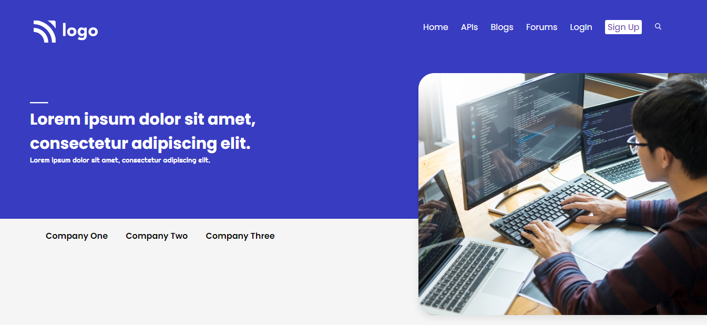
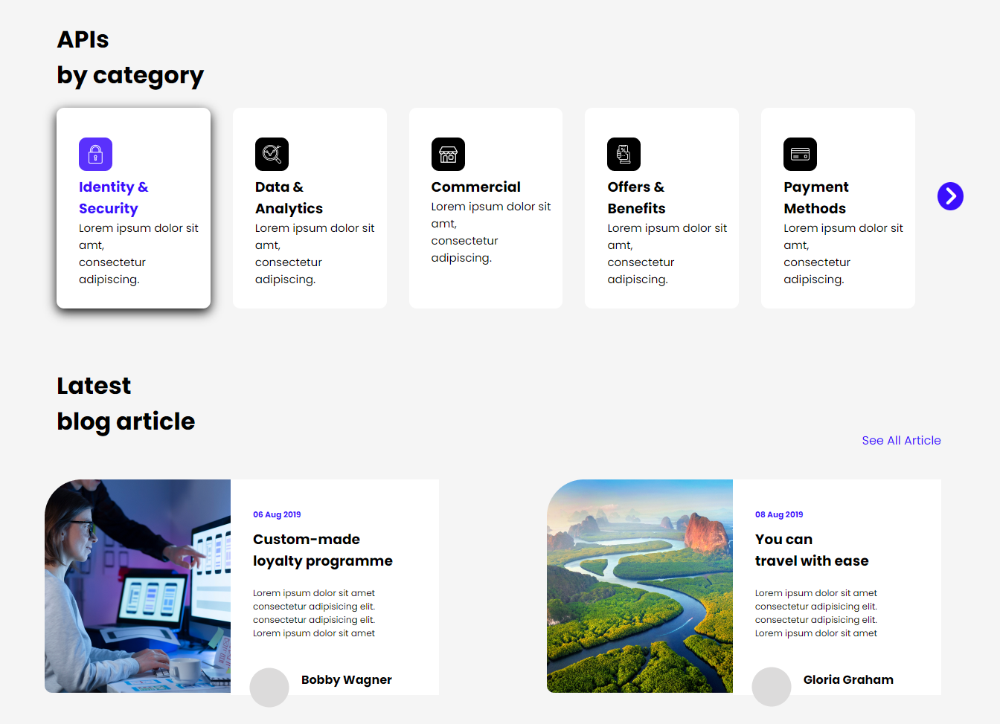
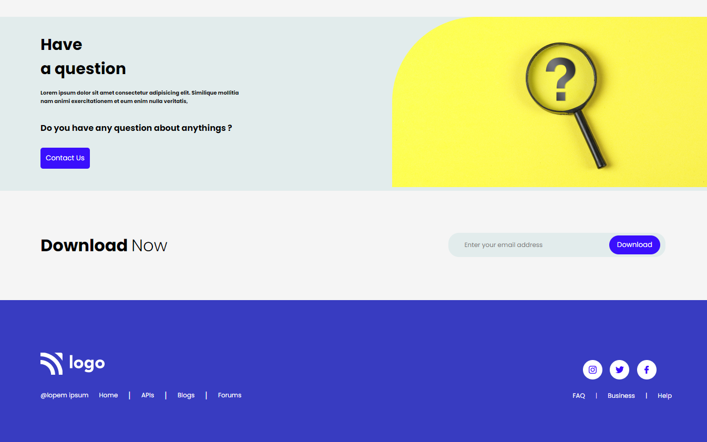

# Developer Landing Page
    This Project Is Completed By Using
        - Html
        - Css
        - Flex
        - Float
        - Media Querry At (600px)
    Floating An Element Makes Work more Easier, 
    It Helped Me Completing This Project Within 10Hrs.
## Developer Landing Page Screenshot

## Media Querry Screenshots

